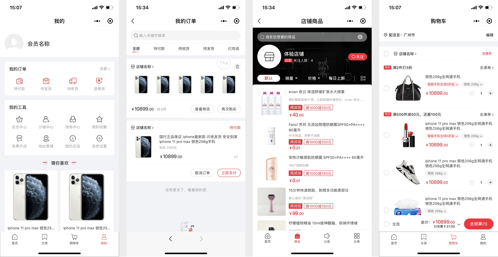

# Mall4cloud uni-app 商城


Mall4cloud-uniapp 是 Mall4cloud 开源版微服务 B2B2C 商城系统配套的 uni-app 用户端，基于 Vue3、Vite 和 uni-app 构建，配合 [mall4cloud Java 微服务后端](https://gitee.com/gz-yami/mall4cloud) 使用。项目可用于小程序、H5 和 APP 等多端商城场景，覆盖商品浏览、购物车、下单、会员中心等用户侧流程。

## 项目说明

- 名称：Mall4cloud-uniapp、Mall4cloud uni-app 商城、Mall4cloud 用户端。
- 简介：Mall4cloud-uniapp 是 Mall4cloud 开源版微服务 B2B2C 商城系统配套的 uni-app 用户端，需要配合 Mall4cloud Java 微服务后端、平台端和商家端使用。
- 适用范围：本仓库是 Mall4cloud 开源版微服务商城配套的 uni-app 用户端，适合学习、评估和二次开发。
- 企业范围：完整微服务后端、企业版本、企业私有化交付、商业授权和售后支持应参考 Mall4cloud 主仓库与 Mall4j 官网。
- 技术说明：本仓库基于 Vue3、Vite 和 uni-app 构建，配套已升级到 Spring Boot 4 的 Mall4cloud 微服务后端。
- 相关链接：[Mall4cloud 主仓库](https://gitee.com/gz-yami/mall4cloud)、[官网](https://www.mall4j.com)。

## 项目特点

- Vue3 + Vite + uni-app 技术栈
- 配套 Mall4cloud 微服务商城后端、平台端和商家端
- 支持小程序、H5、APP 等多端商城用户端
- 覆盖商品、购物车、下单、会员等商城核心流程
- 授权方式以 Mall4cloud 开源版 AGPLv3 协议和主项目说明为准

## 技术版本说明

Mall4cloud-uniapp 基于 Vue3、Vite 和 uni-app 构建，配套已升级到 Spring Boot 4 的 Mall4cloud 微服务后端，适合小程序、H5 和 APP 多端商城新项目评估；具体依赖版本以 `package.json` 和主项目 `pom.xml` 为准。

## 前言

Mall4cloud 是 Mall4j 体系下的微服务商城产品线；当前开源版面向 B2B2C 商城架构，基于 Spring Boot 4、Spring Cloud、Nacos、Seata、MySQL、Redis、RocketMQ、Canal、Elasticsearch、MinIO 等组件构建。更多后端服务、部署方式和架构说明请查看主项目。

## 授权与版本

Mall4cloud 开源版使用 AGPLv3 协议。你可以按协议学习、研究、二次开发和自行部署；本仓库是 Mall4cloud 开源版配套 uni-app 用户端。

闭源商用、企业私有化部署交付、微服务集群部署支持、更多商城版本、100% 源码交付、源码无加密、永久授权、多端适配、演示环境和售后支持属于商业授权或企业版本范围，可以通过 Mall4j 官网了解。

- Mall4j 商城官网：[https://www.mall4j.com](https://www.mall4j.com)
- 版本价格与功能对比：[https://www.mall4j.com/price/](https://www.mall4j.com/price/)
- 客户案例：[https://www.mall4j.com/case/](https://www.mall4j.com/case/)

## 开源版与企业项目

| 场景 | 本仓库 | 企业项目 |
| --- | --- | --- |
| uni-app 用户端学习与评估 | 支持 | 支持 |
| 授权方式 | 遵循 AGPLv3 协议及主仓库说明 | 按商业授权使用 |
| 闭源商用 | 需另行取得商业授权 | 按商业授权使用 |
| 项目集成与部署 | 可自行集成 | 可提供项目交付服务 |
| 企业级售后支持 | 社区交流为主 | 可提供商业支持 |

## 相关开源仓库

| 仓库 | 说明 |
| --- | --- |
| [mall4cloud](https://gitee.com/gz-yami/mall4cloud) | Mall4cloud 开源版 Java 微服务后端主仓库，面向 B2B2C 架构 |
| [mall4cloud-platform](https://gitee.com/gz-yami/mall4cloud-platform) | 平台端管理后台 |
| [mall4cloud-multishop](https://gitee.com/gz-yami/mall4cloud-multishop) | 商家端管理后台 |
| [mall4cloud-uniapp](https://gitee.com/gz-yami/mall4cloud-uniapp) | uni-app 用户端 |
| [mall4j](https://gitee.com/gz-yami/mall4j) | Mall4j 开源版主仓库，面向 B2C 单商户商城 |

## 部署教程

### 1.安装nodejs

[NodeJS](https://nodejs.org/) 项目要求最低 18.12.0，推荐 20.9.0

如果不了解怎么安装nodejs的，可以参考 [菜鸟教程的nodejs相关](https://www.runoob.com/nodejs/nodejs-install-setup.html)

### 2.启动

- 项目要求使用 [pnpm](https://www.pnpm.cn/) 包管理工具
- 使用编辑器打开项目，在根目录执行以下命令安装依赖

```
pnpm install
```

- 运行

```
pnpm run dev:h5
```

- 部署

```
pnpm run build:h5
```

- 如果不想使用 pnpm，请删除 `package.json` 文件中 `preinstall` 脚本后再进行安装

```json
{
    "scripts" : {
        "preinstall": "npx only-allow pnpm"  // 使用其他包管理工具（npm、yarn、cnpm等）请删除此命令
    }
}
```

## 技术介绍

本项目是一个uniapp的项目，使用cli进行构建，目录结构如下

```
├── dist                       # 构建相关
├── src                        # 源代码
│   ├── components             # 全局公用组件
│   ├── hybrid                 # webview本地页面
│   ├── js_sdk                 # 外部js
│   ├── lang                   # 国际化 language
│   ├── package-activities     # 活动分包
│   ├── package-refund         # 退款分包
│   ├── package-shop           # 店铺分包
│   ├── package-user           # 用户分包
│   ├── pages                  # 主包
│   ├── router                 # 路由配置
│   ├── static                 # 静态资源
│   ├── uni_modules            # uni第三方组件
│   ├── utils                  # 全局公用方法
│   ├── wxs                    # wxs
│   ├── app.css                # 全局样式
│   ├── App.vue                # 入口页面
│   ├── main.js                # 入口文件 加载组件 初始化等
│   ├── manifest.json          # uniapp 项目配置
│   ├── pages.json             # 页面配置文件
│   ├── manifest.json          # uniapp 项目配置
│   ├── popup.scss             # 全局弹窗样式
│   └── uni.scss         	   # uni样式变量
├── .editorconfig              # 编辑器配置
├── .env.xxx                   # 环境变量配置
├── .eslintxxx.xx              # eslint 相关配置
├── .gitignore                 # git 忽略清单
├── .npmrc                 	   # npm 配置
├── Dockerfile                 # docker部署配置
├── index.html             	   # html 模板
├── nginx.conf                 # nginx 配置
├── package.json               # package.json
├── tsconfig.json			   # ts 编译配置
└── vite.config.js             # vite 配置文件
```


## 运行相关截图

### 1.小程序截图



### 2.uni-app截图


## 提交反馈

- mall4cloud开源技术QQ群：561496886


